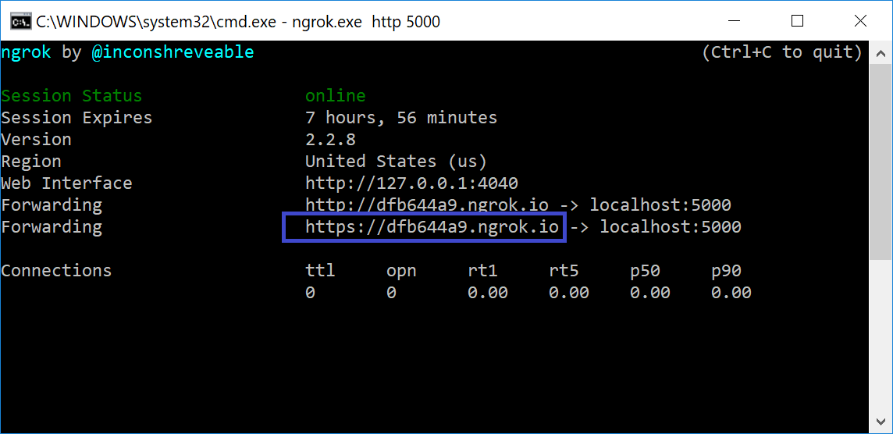
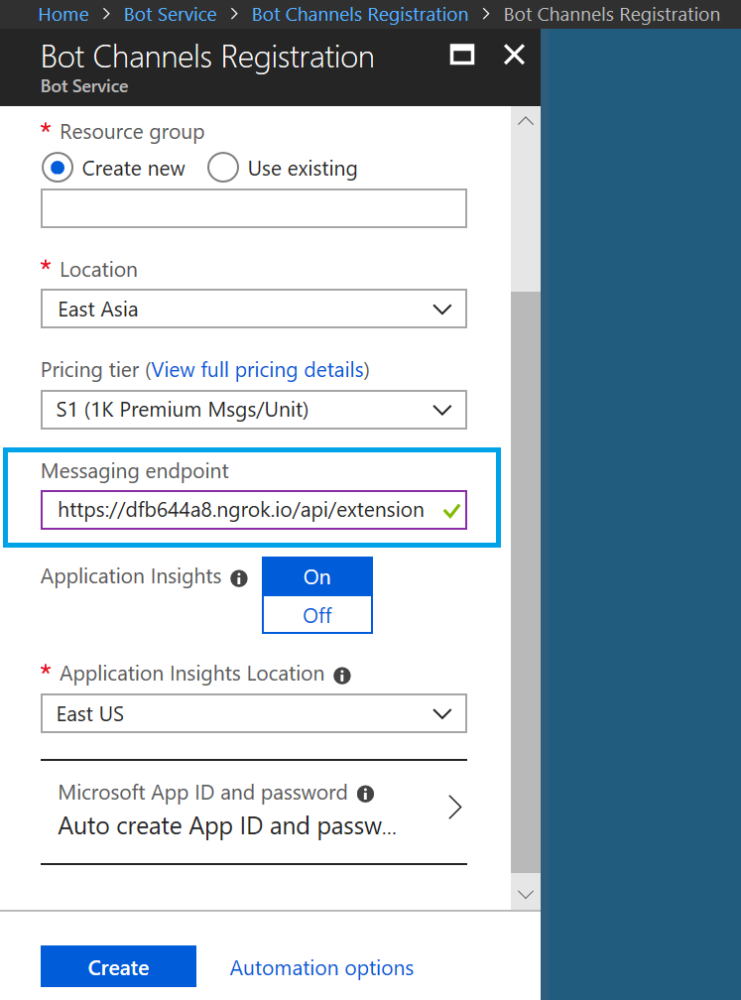
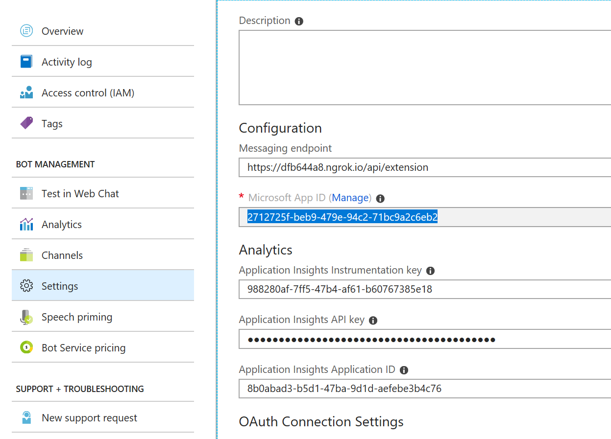
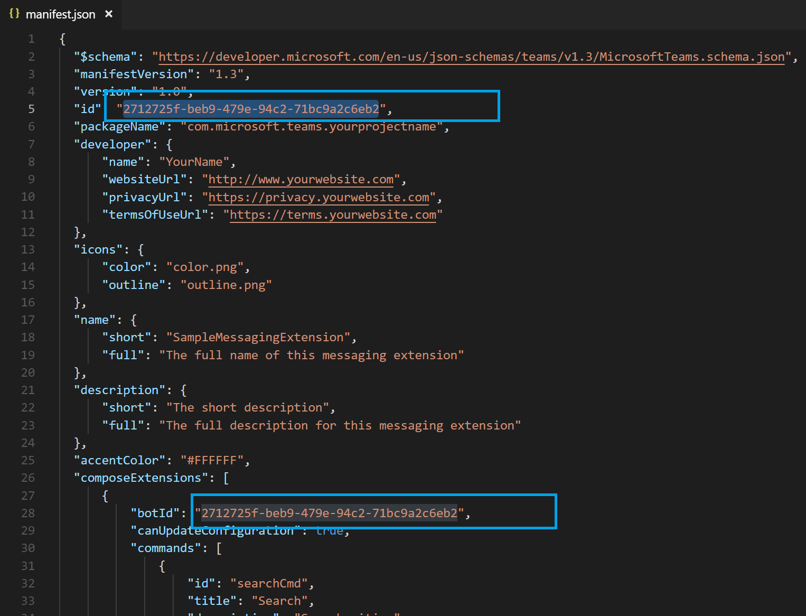
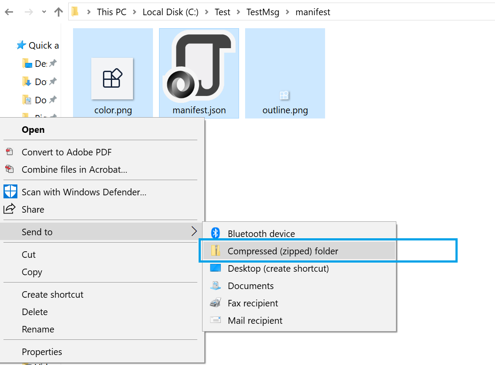
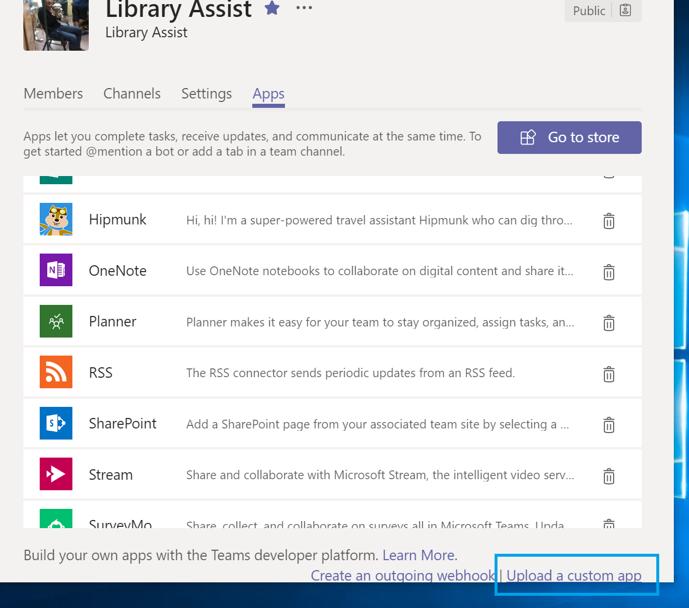
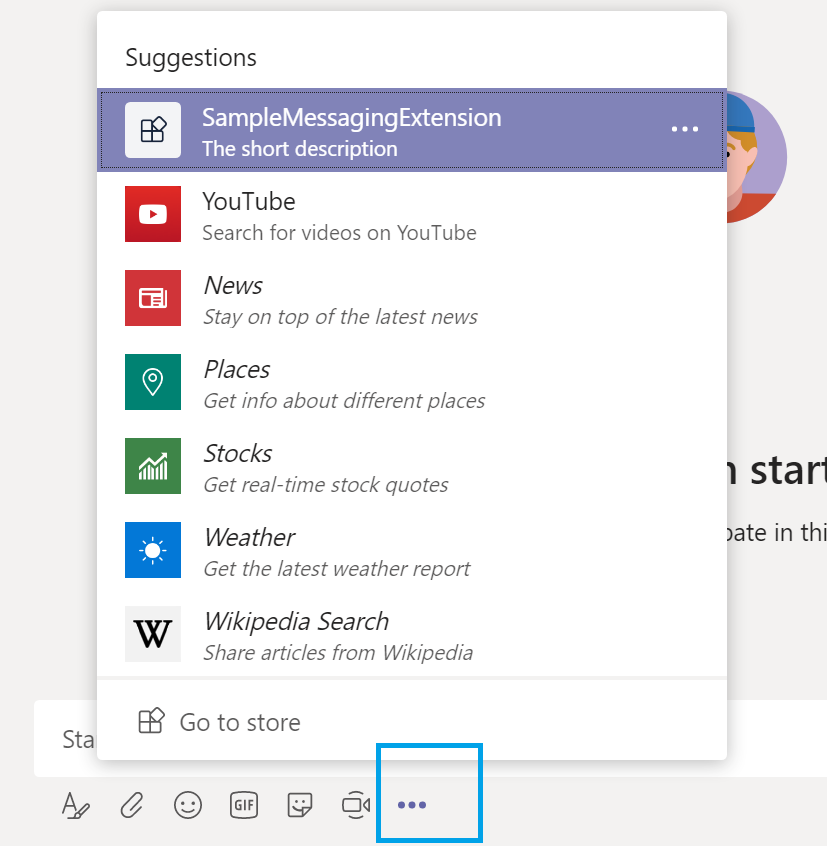
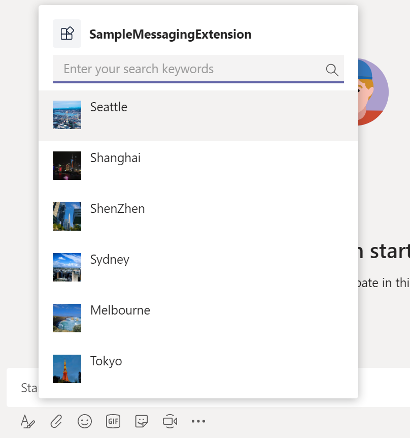
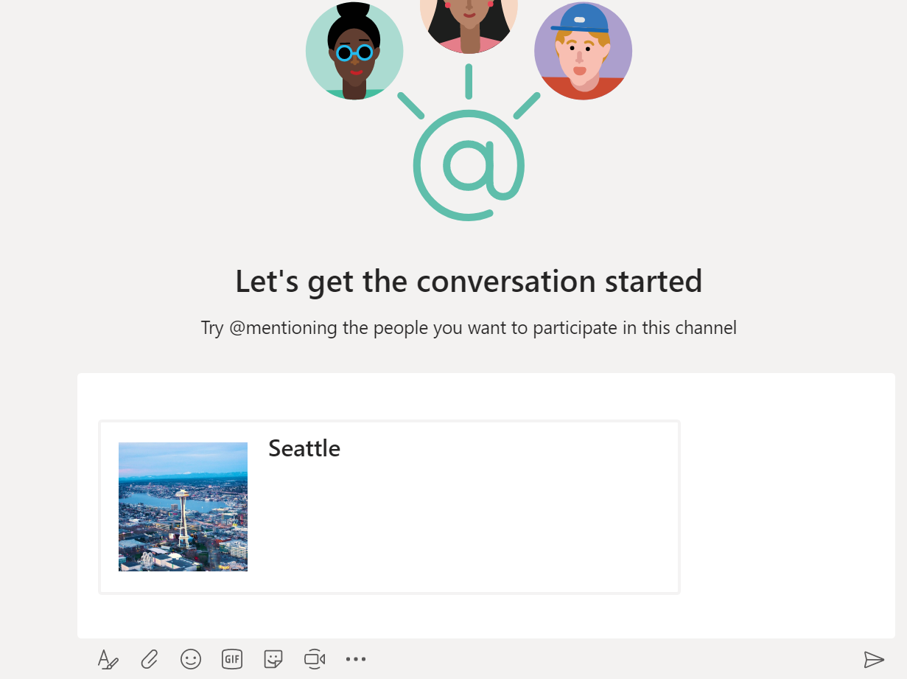

# Develop a messaging extension

* Run `ngrok.exe http 5000`, because our web api project will listen on port 5000.
* Copy the ngrok url.

* Create a bot using Teams App Stdio or the BotFramework web [https://dev.botframework.com/bots/new](https://dev.botframework.com/bots/new). Greater detail can be found [here](https://docs.microsoft.com/en-us/microsoftteams/platform/concepts/bots/bots-create). Regards to the `Messaging endpoint`, input the ngrok url with the postfix `/api/extension`

* When a bot is created, remember the `Microsoft App ID` which will be used in the next step.

* Run `dotnet new teamsmsgext --name SampleApp` to generate the project.

* Open `SampleApp/manifest/manifest.json` file, paste `Microsoft App ID` you got in previous step.

* Zip `SampleApp/manifest` folder into manifest.zip file.

* Upload manifest.zip file into your Teams. `Manage Team -> Apps`, click the bottom-right link `Upload a custom app`

* Start the project by running `dotnet run`.

* All done, you can switch to Microsoft Teams, go to a team's channel into which you have uploaded the custom app(the zip file), click the `...` button, you can find your messaging extension.

