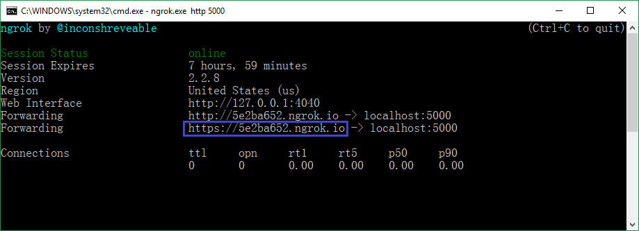
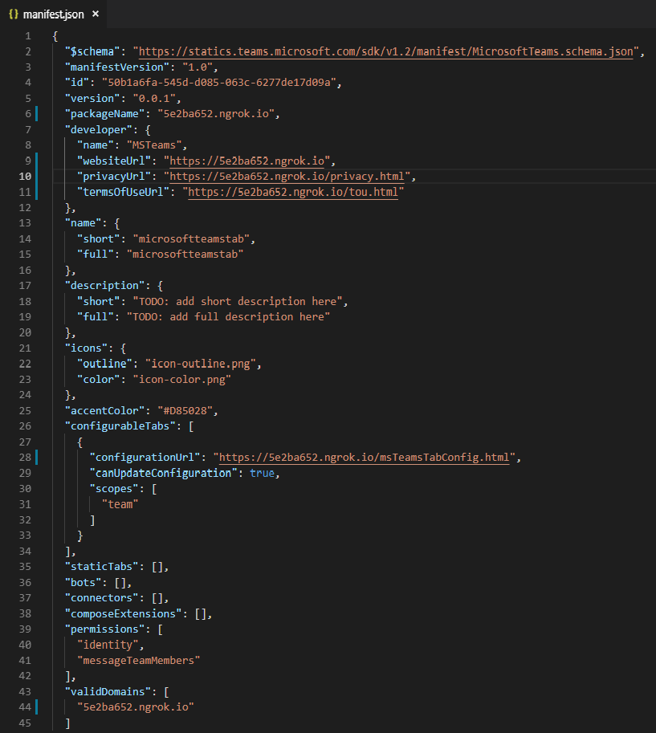
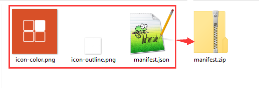
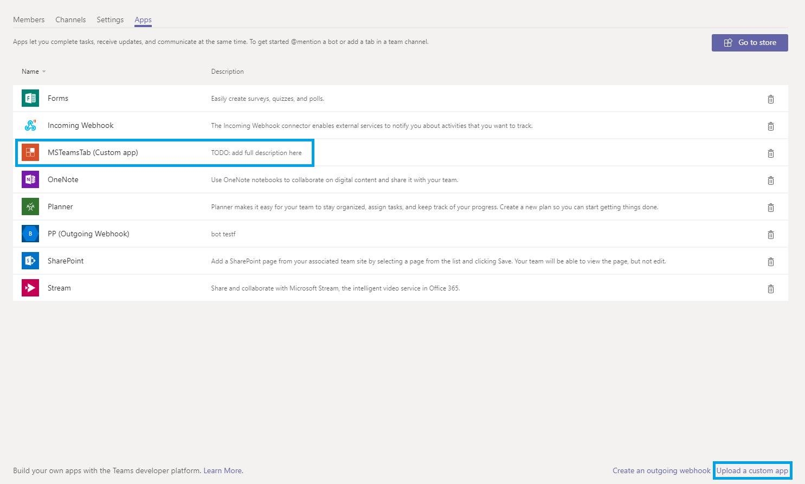
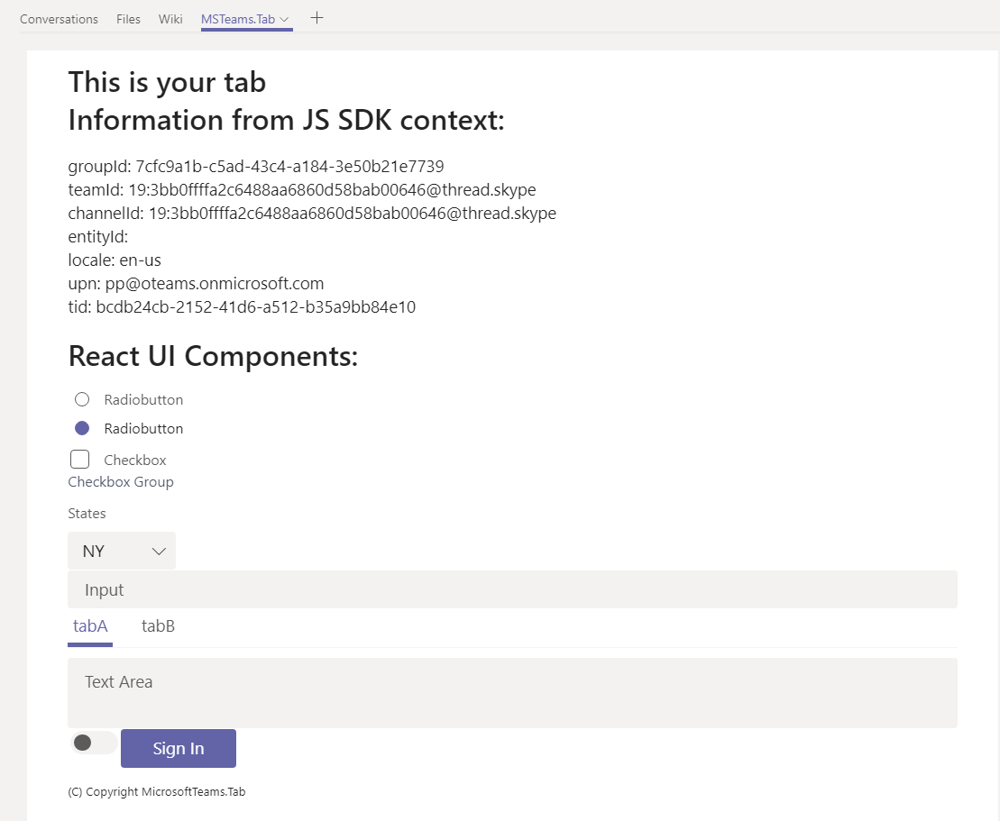

# Developing and debugging a tab locally

## Prerequisites

The following tools should be installed.

1. [node](https://nodejs.org/en/)
2. [npm](https://www.npmjs.com/)

## Steps

* Install ngrok from [https://ngrok.com/](https://ngrok.com/)
* Run `ngrok.exe http 3007`, because our node project will listen on port 3007.
* Copy the ngrok url(https).

* Open the manifest.json file, and update it accordingly using copied url.

* Compress files 'manifest.json' & 'icon-outline.png' & 'icon-color.png' into a file named manifest.zip. The zip file will be uploaded to Teams.

* Run command to start the node server.
    1. > npm install
    2. > npm run build
    3. > node .\dist\server.js

* Open Microsoft Teams, create a Tab.
    1. Navigate to 'Apps' tab in a certain team.
    2. Click 'Upload a custom app' at the right bottom corner of the page.
    3. Select manifest.zip and click Open.
    

* Click "MicrosoftTeams.Tab" app uploaded just now, And set it up for a channel.

* Run `dotnet new teamstab --name SampleApp` to generate the project.